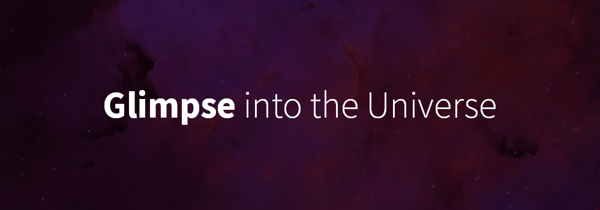

<h3 align="center">
    &#x2B21;
    <a href="https://github.com/NeffCodes/universe/issues">Report Bug</a> &nbsp; &nbsp;
    &#x2B21;
    <a href="https://github.com/NeffCodes/universe/issues">Request Feature</a>
</h3>

____

Every day, NASA features a different image of our fascinating universe. This site allows you to see a gallery of the most recent choices to see how diverse our universe is with descriptions written by professional astronomers!

**Link to project:** [https://glimpse-universe.netlify.app/](https://glimpse-universe.netlify.app/)

## 💻 Tech Used

 HTML, CSS, JavaScript, NASA APOD API, Netlify, Postman

## ✏️ My Approach

After reading the documentation provided by NASA, I started by planning out how I wanted to display the provided data. Per the documentation, to pull multiple images from their api, I could either get a count of random images or pull from a specific date range. I wanted to allow users to view the most recent submissions, so I decided to write some code to find the necessary date range based on the current date whenever a visitor comes to the site.

Once I finalized the functionality of the data pull, I was able to work on how I wanted to display the data. I went with a simple tiled photo gallery that covered the full screen to allow the user to see multiple images at the same time.

While working on the overall design of the site, I noticed the explanations provided from NASA could vary in length. This lead me to revise my original plan of having a small description box to instead be a scrollable frame to allow users to be able to read the full description, regardless of length.

## 📚 Lessons Learned

I learned more about NASA's API, and how to write good documentation. I also got to dive more into Netlify's Functions for hiding API keys and proper usage.

## 💡 Contributing

Found an issue or want to add a cool feature to this site? Awesome! Leave a comment in the issues tab and I will assign it to you.

1. Comment in the issues [tab](https://github.com/NeffCodes/universe/issues)
2. Fork or clone this repo
3. Build the code you wish to add
4. Create a pull request
